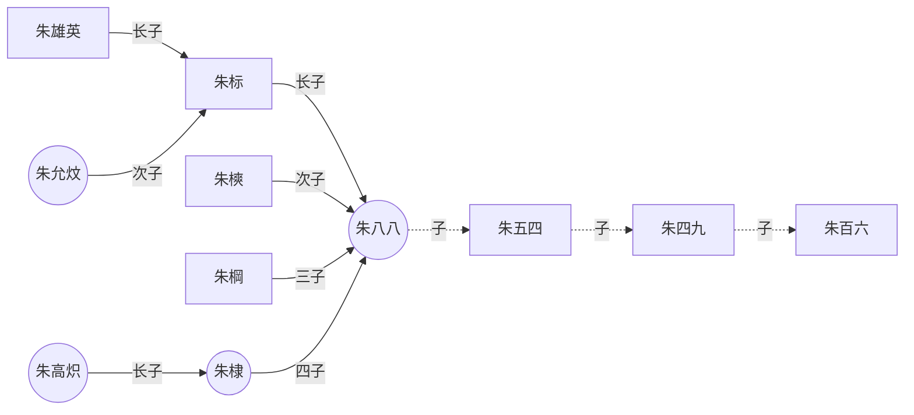
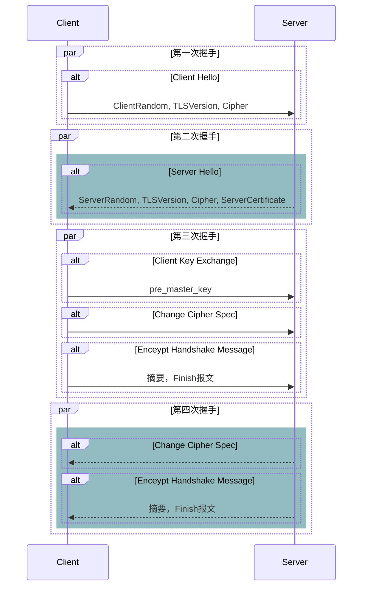

# Example

!> 一段重要的内容，可以和其他 **Markdown** 语法混用。


## Tag Example
<!-- tabs:start -->
#### **Python**
```python
import requests
requests.get('https://www.baidu.com')
```

#### **Java**
```java
package com.ushareit.model.meta;
```

#### **Golang**
```go
package main
```
<!-- tabs:end -->


## Mermaid Example

### Mermain graph



### Mermain sequenceDiagram


